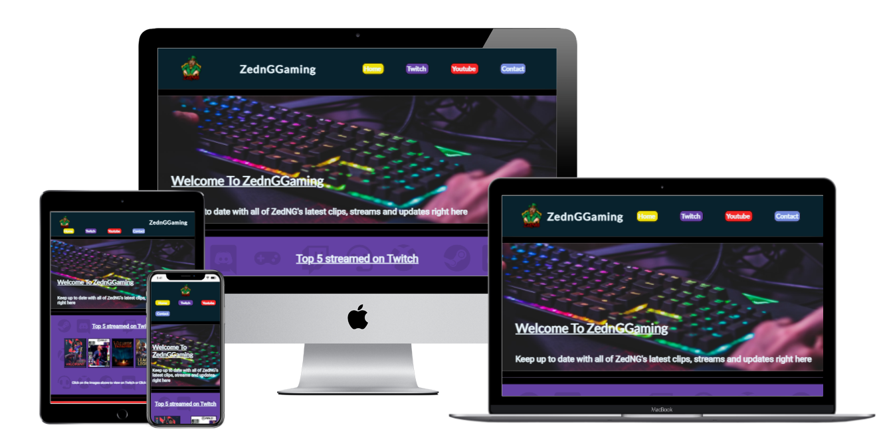
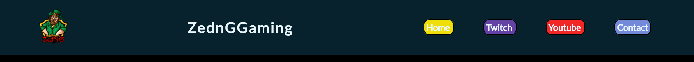
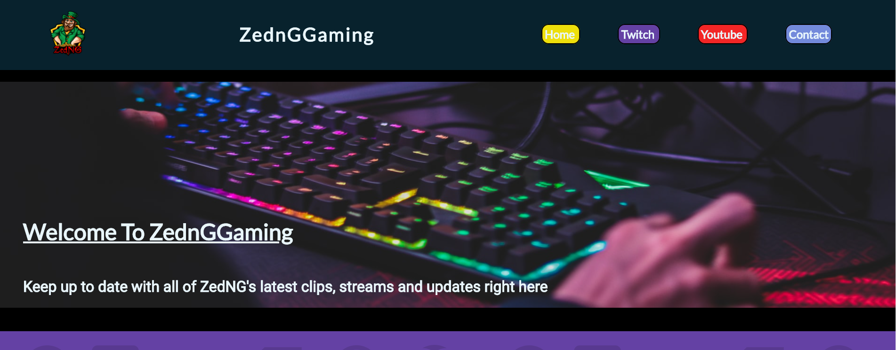
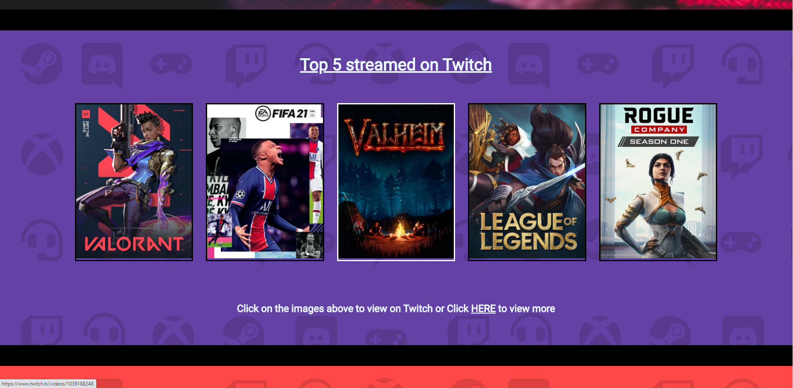
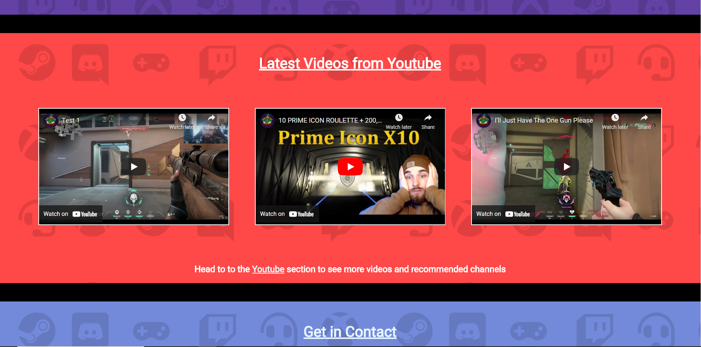
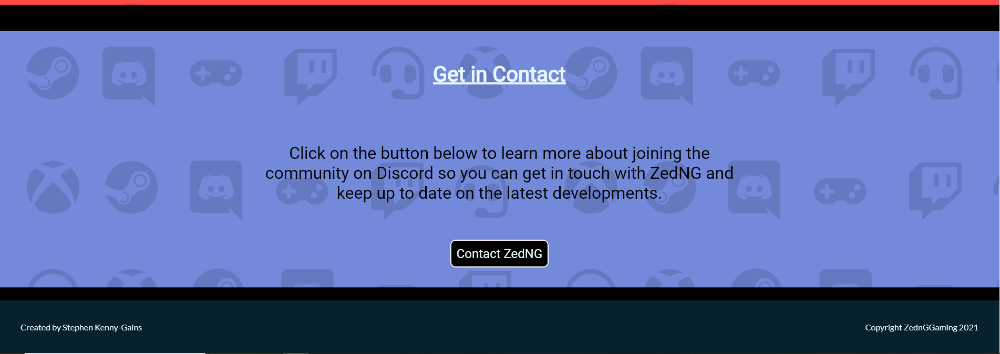
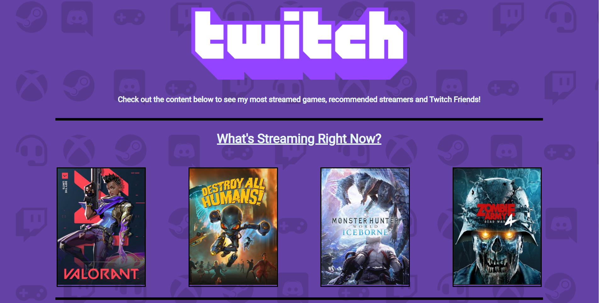
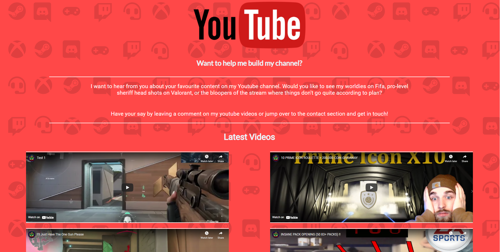
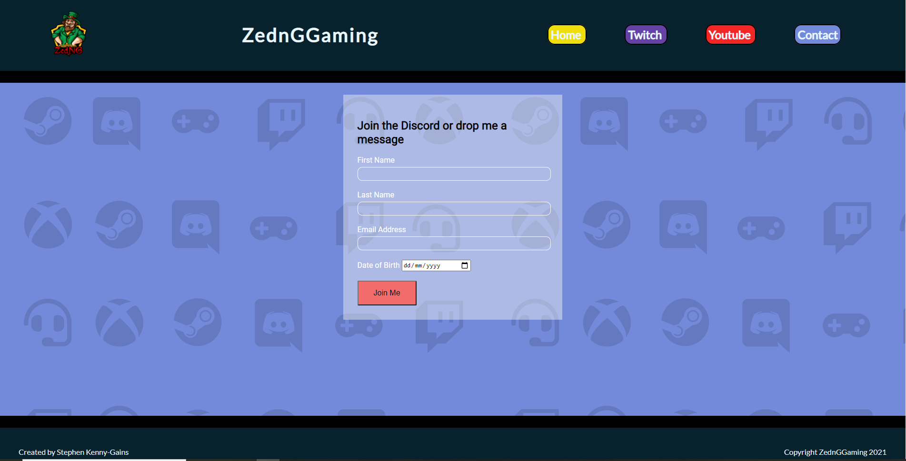

# ZednGGaming

This site is intended to show the multi-platform content of Irish Games Streamer, Zedng, in one location with the future intention of also adding a market place for merchandise and subscritpion services. The page links and highlights ZedNG's Twitch and Youtube content and adds an additonal method for new fans to join his Discord server.

ZedNG streams games regualarly to Twitch and uploads highlights of the streams to Youtube as highlight reels. As his following grows he intends to sell merchandise to his audience and the intention of the website will be to both, bring twitch followers over to his youtibe channel and vice-versa along with having regular traffic to the site so when his online store is ready there will already be a steady traffic flowe through the site.

## Features 

The site is broken into 3 main sections being Twitch, Youtube and Contact which leads to his Discord channel. 

Twitch- This section is designed to highlight his top streamed games and currently streamed games to show his audience what games are currently in roatation and the type of content they can expect. Along with his own streams, there are also recommended channels he enjoys and fellow streamers he works with regularly for cross promotion. 

Each image of both games and streamers is a hyperlink redirecting the user to a seperate page on Twitch where they can jump straight to the stream or user highlighted for easy access to his content.

Youtube- This section shows his most recent uploads and highlights some of his favourite clips along with displaying some variety to his content as a highlight to show diversity in his streams. The videos uploaded can play in screen to avoid leaving the page and also have the option to watch directly on youtube to bring users to his youtibe page. Additionally there are some of his preferred Youtube users to give an insight into his preferred viewing.

Contact page- This page is the most basic design to avoid any confusion through this section by just keeping it as a simple form with a descriptive title telling the user what completing the form will accomplish.

### Navbar and Footer

- __Navigation Bar__

  - The navigation bar features the site logo which brings the user back to the home page, the page title and links to the Home, Twitch, Youtube and Contact page. 
  - The colour chosen was to be easily ditinguished from the black borders and outlines of other features whilst still being a contrasting colour to the vibrant colour schemes of the main pages.

- __Footer__

  - The footer follows the same colour scheme as the header for a uniform design. 
  - The features have been kept minimal to only show my own details, social links to the instagram and github repository and copyright info. 

- __Home Page Hero image__

  - The home page uses a hero image at the head of it to show that the page is directed towards gaming by featuring a gaming setup which uses similar vibrant colours to those of the page.
  -There is a short text overlay to show immeidately to users what the page is about and what to expect.

- __Twitch Section__

  - The Twitch section gives a preview of the type of content on the full Twitch page of the site and offers a quick access section to view content immediately upon landing on the page.
  - The colour scheme used is that of Twitch's brand.

- __Youtube Section__

  - Following the same pattern as the twitch section this gives users the option to view youtube content directly on the site without moving to Youtube. 
  - The colour scheme again follows that of Youtubes brand but with the transparency increased to make it a more pleasant view to the user as the vibrancy is too strong on such a large scale. 

- __Contact Section__ 

  - The contact section is more minimal on the home page to follow the same design as the Contact page itself. It gives a short amount of information along with a button to redirect to the contact page.
  - The whole page has an underlay of various gaming symbols that are associated with ZedNG such as the Twitch logo, Discord Logo, Xbox logo and a gamepad which helps to reduce the dominance of the colour schemes and also gives users a very clear insight into the pages intentions.

- __Twitch Page__

  - The Twitch page shows the current roatation of games being played right now, top streamed games, recommeded channels and partner streamers. 
  - The design is set to alternate from square imagery to the rounded imagery of other streamers and friends to have contract in the design.
  - The imagery is all clickable to redirect the user to the associated stream or channel.

- __Youtube Page__

  - The Youtube page follows a slightly different design by having the first section as text asking followers to contribute to the content by commenting on videos or getting in contact through the form on the contact page.
  - The videos on the page can be played on the site to avoid users leaving the site where possible.
  - The page also has recommended channels similar to the Twitch page to continue following a uniform design page to page. 

- __Contact Page__

  - The contact page is the most minimal on the site to make it easy for users to avoid any confusion and get straight to their contact form. 
  - The form has a design to simply contrast the background colours and overlay running through the page. 
  - As the discord logo is featured through the page in the overlay imagery it has been left out of this page.

### Features Left to Implement

- As mentioned earlier, the site will add a store page.
- The store page will be added when the stremer ZedNg feels their following is significant enough to bring in this feature.
- The store will be for merchandise such as clothing, gaming accesories or additional subsrciption services. 

## Testing 

Given the high amount of external linking, the page needed to be chacked regularly for the following,

__Internal Links__

- The page links are both in the navbar of the page but also featured in the home page sections dividing the page. 
- The navbar links are tested page to page to ensure each is directing to the correct page or section.
- The same had to be done for links in associated areas such as the link at the bottom of the Youtube, Twitch and contact section on the landing page to make sure they are bringing the user to the correct page.

__Twitch Links__

- Twitch links related to videos both redirect the user to the associated video but in some cases also specifically jump to time stamps of particular videos.
- The reason for this is that some streams cover multiple games as they could be played over 6 hours where 1 game is played for the first half of a stream and another for the other half. For a better user experience, where possible the link will jump directly to the period in each stream where the featured game is being played.
- In cases where this was not possible it will direct to the landing Twitch page of ZedNG.
- Links needed to all be individual for this and tested to ensure they directed to the correct content where possible.

__Youtube Links__

- The Youtube videos on the page use Youtubes interface to play the video in the same window and have been tested to ensure the payback is successful without redirection.
- The additional features of Youtbes interface were also tested such as the options for volume, skipping and watching directly on Youtube.
- The recommended channels section was tested to ensure that the user is brough directly to the channel shown and not to Youtubes Landing page. 

__Contact Form Button__

- Initially the submit button on the form in the contact section was of type submit which does not have an area for the information to go.
- this was fixed by changing the type from submit to button to avoid the page attempting to load a page it could not. 

### Validator Testing 

- HTML
  - No errors were returned when passing through the official [W3C validator](https://validator.w3.org/nu/?doc=https%3A%2F%2Fcode-institute-org.github.io%2Flove-running-2.0%2Findex.html)
- CSS
  - No errors were found when passing through the official [(Jigsaw) validator](https://jigsaw.w3.org/css-validator/validator?uri=https%3A%2F%2Fvalidator.w3.org%2Fnu%2F%3Fdoc%3Dhttps%253A%252F%252Fcode-institute-org.github.io%252Flove-running-2.0%252Findex.html&profile=css3svg&usermedium=all&warning=1&vextwarning=&lang=en#css)

### Unfixed Bugs

So far through testing there have been no bugs which have not been fixed. Bugs which needed to be fixed during the development included incorrect linking to the landing pages of sites instead of directly to the intended page, diplay issues when changing screen size, mis-alignment of imagery and alignment of imagery with the titles along with the image. Each have been resolved and no new issues have been found. 

## Deployment

This section should describe the process you went through to deploy the project to a hosting platform (e.g. GitHub) 

- The site was deployed to GitHub pages. The steps to deploy are as follows: 
  - In the GitHub repository, navigate to the Settings tab 
  - From the source section drop-down menu, select the Master Branch
  - Once the master branch has been selected, the page will be automatically refreshed with a detailed ribbon display to indicate the successful deployment. 

The live link can be found here - https://stephenkennygains.github.io/ZednGGaming/ 

## Credits 

 

### Content 

- Text throughout the page is written personally and has not been pulled from any external sites.
- External pages linked which are not associated with the streamer ZedNG are as follows;
- https://www.twitch.tv/
- https://www.twitch.tv/averagejonas
- https://www.twitch.tv/shroud
- https://www.twitch.tv/pokimane
- https://www.twitch.tv/tenz
- https://www.twitch.tv/search?term=buckarmy
- https://www.twitch.tv/kianuki
- https://www.twitch.tv/el_keeko
- https://www.twitch.tv/tradiac
- https://www.twitch.tv/el_edz

- https://www.youtube.com/
- https://www.youtube.com/channel/UCUT8RoNBTJvwW1iErP6-b-A
- https://www.youtube.com/user/pokimane
- https://www.youtube.com/user/JNavarsete
- https://www.youtube.com/channel/UCWxlUwW9BgGISaakjGM37aw

- The icons through the page were taken from [Font Awesome](https://fontawesome.com/)

### Media

- Page logo is that of the streamer ZedNG
- The hero image on the page was taken from unsplash and credit goes to https://unsplash.com/@axville. Image link to unsplash- https://unsplash.com/photos/WcrqKjgMPfI
- All images for the Youtube and Twitch section of the page were pulled directly from Youtube and Twitch and their respective channels which are linked above.
- The Youtube and Twitch logo were taken from both Twitch and Youtubes brand guideline pages to ensure they were accurate and up to date imagery and also where the colour codes were taken from.
 

 
